# Titulo: Prototipo De Una Aplicación Web Para El Almacenamiento De Información Sobre La Gestión De Residuos Electrónicos En La Localidad De Chapinero
---
## Overview: Problema a resolver
Este proyecto nace frente a la problemática actual en Bogotá "la falta de información confiable sobre la cantidad de desechos electrónicos que no son reutilizados",  los datos que se tienen son dados a conocer por fuentes poco confiables, las cuales se basan en entrevistas o aproximando datos y en muchos casos brindado información errónea o muy aproximada.
 
Además “en Bogotá existe una deficiente participación de los ciudadanos para separar en la fuente, una tarea indispensable para que sea posible recuperar mayores cantidades de residuos. La administración debe hacer esfuerzos para mejorar la información disponible pues la meta en el Plan de Desarrollo es lograr reducir 30% los residuos dispuestos en el relleno sanitario, pero los ciudadanos pueden empezar por tener bolsas diferenciadas en casa y hacer un esfuerzo por poner en la blanca material que se pueda recuperar y en la negra lo que debe ir a la caneca ( Bogotá Cómo Vamos, 2020)”.

### Alcance(Scope)
Brindar a los habitantes de Bogotá una base de datos sólida para la construcción de futuros proyectos, con datos fiables y comprensibles para los usuarios.

#### Casos de uso
* Caso de uso 1 - Registrar Usuario
Descripción: Para el registro de un nuevo usuario el software solicitará al mismo la siguiente información: Nombre, Correo, Fecha de nacimiento, Número de teléfono y ocupación.
Una vez realizado el registro se enviará un correo de confirmación el cual le permitirá re dirigirse al menú principal de la aplicación. 

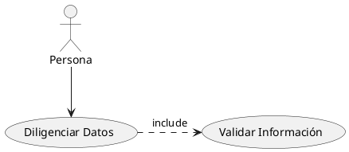

* Caso de uso 2 - Consultar reciclaje por usuario
Descripción: El usuario podrá visualizar la cantidad de puntos que posee, van a estar listados en una tabla con la fecha, lugar y cantidad de desechos electrónicos depositados, con una breve descripción del electrodoméstico. El administrador podrá ver esta descripción,  podrá eliminar o modificar los datos de la misma.
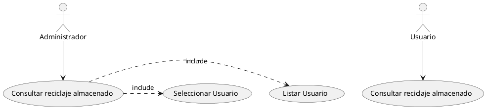
* Caso de uso 3 - Visualizar meta de reciclaje
Descripción: A cada usuario se le asignará una meta para poder reclamar su bonificación, por ejemplo: si el usuario quiere reclamar boletos para cine necesitará x cantidad de reciclaje. Esto se hace con el fin de incentivar al usuario a depositar sus electrodomésticos. Además, podrá ver su meta en semanas o en meses.

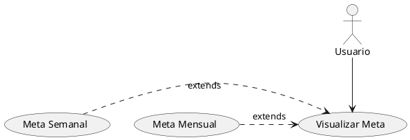
* Caso de uso 4 - Enviar mensaje al administrador.
Descipcion: El usuario podrá enviar y visualizar los mensajes, se presentarán varias opciones para modificar el texto adjuntado. Se tendrá un apartado para enviar archivos adjuntos y aparecerá una lista con los archivos adjuntos y el tipo de archivo.

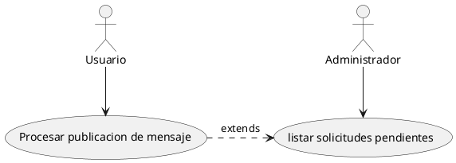
* Caso de uso 5 - Consultar sitio de reciclaje.
Descripcion: El usuario podrá consultar su sitio de reciclaje más cercano, al ingresar le pedirá al usuario su ubicación y le permitirá ver el eco-punto más cercano.
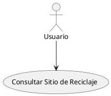
* Caso de uso 6 - Agregar Sponsor.
Descripcion: Un sponsor que no tiene que estar registrado en la aplicación, se podrá comunicar con un administrador para ofrecer sus servicios a los usuarios (Bonificaciones).
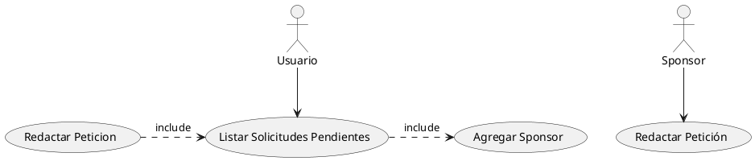

#### Out of Scope (casos de uso No Soportados) - Requerimientos no funcionales

* Performance del sistema.
El software no tiene que tardar en la carga de las distintas pestañas y debe brindar un tiempo de respuesta de máximo 4 segundos.
Garantizar un tiempo moderado al usuario en la navegación entre páginas, el tiempo de envío de los mensajes y la correcta carga de medios audiovisuales.

* Adaptabilidad
La página debe comportarse de manera correcta en dispositivos móviles, tablets y escritorios, brindando una correcta visualización de la información.
El software debe garantizar el correcto funcionamiento en cada dispositivo, con todas las funcionalidades requeridas para esta aplicación, y que soporte las peticiones desde distintos dispositivos.

* Seguridad de la información.
El sistema garantizará a los usuarios seguridad en cuanto a la información que se solicite en la aplicación.
El sistema brinda protección contra el acceso de datos e información no autorizados. También debe demostrar la acciones o eventos que han tenido cambios demostrando la identidad de un sujeto o un recurso.

* Mantenimiento del sistema
Permitir que el sistema sea modificado por el administrador de forma efectiva y eficiente sin introducir defectos o degradar el desempeño
El sistema deberá de tener un manual de instalación y manual de usuario para facilitar los mantenimientos que serán realizados por el administrador. Debe brindar la capacidad para ser modificado a necesidades evolutivas, correctivas o perfectivas.

* Interfaz intuitiva
Letra clara.
El sistema debe tener una interfaz de uso intuitiva y sencilla.
Se incluirá la fabricación de una interfaz de usuario clara y fácil de usar, se utilizará un menú de navegación que se adapten a dispositivos móviles para una mayor facilidad de uso en estos dispositivos, con letra clara y entendible para el usuario de la aplicación.

---
## Arquitectura

### Diagramas
poner diagramas de secuencia, uml, etc

### UML: Diagram de Clases
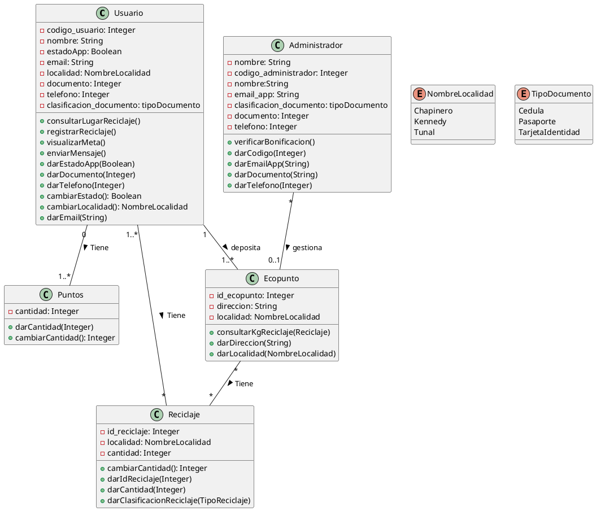

UML: Diagram de Clases (Herencia)

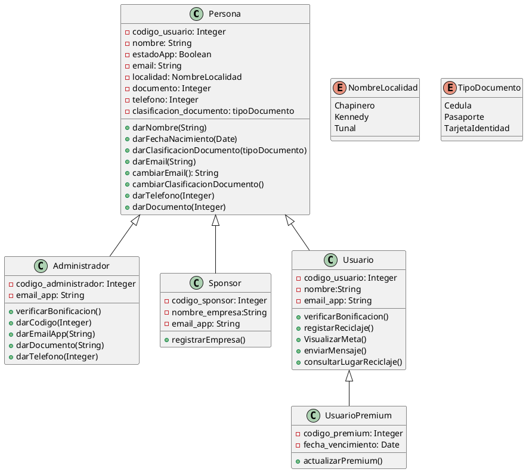

### Modelo de datos
Poner diseño de entidades, Jsons, tablas, diagramas entidad relación, etc..

* Json Persona
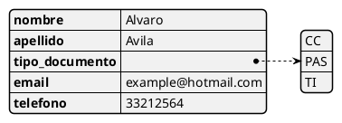
* Json Usuario
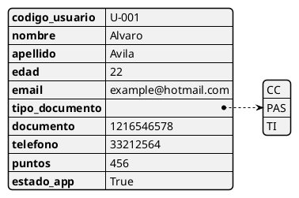

* Json Administrador
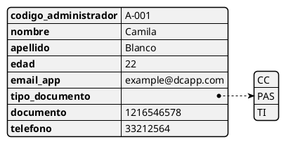

* Json Sponsor

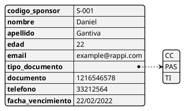

* Json Reciclaje

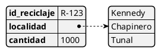
* Json Ecoputo

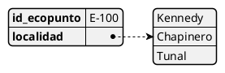

* Json CantidadPunto

```plantuml
@startjson
{
   "cantidad":"1100"
}
@endjson

```
* Json UsuarioPremium

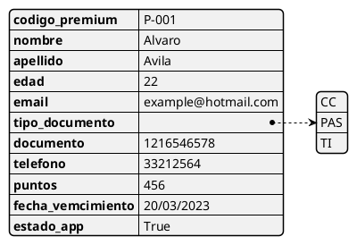

---
## Limitaciones

* Un administrador no puede tener más de 100 peticiones sin responder.
* Una persona no puede tener más de 1 usuario.
* En horas de matenimiento no se podra recibir bonificaciones.
* Una persona no puede interactuar con la aplicacion sin antes realizar un "Logueo".
* Capacidad de proceso muy pequeña o poca memoria, debido a que sera desplegado en un host gratuito (momentaneamente).
* Nivel de servicio de muy baja calidad (muchas caídas y paradas de mantenimiento).
---
## Costo
Esta aplicación se hará sin ánimo de lucro, no estamos buscando un beneficio financiero para los integrantes del proyecto, buscaremos un bien ambiental y la incentivación para nuevos proveedores. 
Al tener el software y la base de datos funcional se buscará entes públicos o privados para el apoyo financiero del proyecto. Además, se indagará de apoyos para nuevos proyectos en el gobierno actual, como lo es el programa MinCiencias que busca el cumplimiento de los objetivos de desarrollo sostenible ayudando al crecimiento de proyectos de desarrollo comercial y prototipos funcionales.

