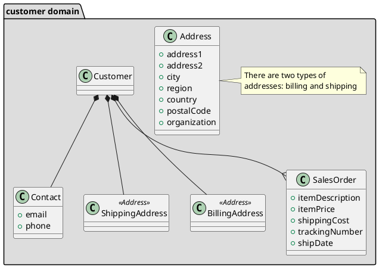

# Titulo: Prototipo De Una Aplicación Web Para El Almacenamiento De Información Sobre La Gestión De Residuos Electrónicos En La Localidad De Chapinero
---
## Overview: Problema a resolver
Descripción..

### Alcance(Scope)
Descripción..

#### Casos de uso
* Caso de uso 1 - Registrar Usuario
Descripción: Para el registro de un nuevo usuario el software solicitará al mismo la siguiente información: Nombre, Correo, Fecha de nacimiento, Número de teléfono y ocupación.
Una vez realizado el registro se enviará un correo de confirmación el cual le permitirá re dirigirse al menú principal de la aplicación. 

* Caso de uso 2 - Consultar reciclaje por usuario
Descripción: El usuario podrá visualizar la cantidad de puntos que posee, van a estar listados en una tabla con la fecha, lugar y cantidad de desechos electrónicos depositados, con una breve descripción del electrodoméstico. El administrador podrá ver esta descripción,  podrá eliminar o modificar los datos de la misma.

* Caso de uso 3 - Visualizar meta de reciclaje
Descripción: A cada usuario se le asignará una meta para poder reclamar su bonificación, por ejemplo: si el usuario quiere reclamar boletos para cine necesitará x cantidad de reciclaje. Esto se hace con el fin de incentivar al usuario a depositar sus electrodomésticos. Además, podrá ver su meta en semanas o en meses.

* Caso de uso 4

* Caso de uso 5 

* Caso de uso 6

#### Out of Scope (casos de uso No Soportados)
Descripción...
* Caso de uso 1
* Caso de uso 2
* ...

---
## Arquitectura

### Diagramas
poner diagramas de secuencia, uml, etc
#Caso de uso Uno

### uml: class diagram

### Modelo de datos
Poner diseño de entidades, Jsons, tablas, diagramas entidad relación, etc..

* Json Persona

* Json Usuario

* Json Administrador

* Json Sponsor

* Json Reciclaje

* Json Ecoputo

* Json CantidadPunto

* Json UsuarioPremium

---
## Limitaciones
Lista de limitaciones conocidas. Puede ser en formato de lista.
Ej.
* Llamadas del API tienen latencia X
* No se soporta mas de X llamadas por segundo
---
## Costo
Descripción/Análisis de costos
Ejemplo:
"Considerando N usuarios diarios, M llamadas a X servicio/baseDatos/etc"
* 1000 llamadas diarias a serverless functions. $XX.XX
* 1000 read/write units diarias a X Database on-demand. $XX.XX
Total: $xx.xx (al mes/dia/año)
